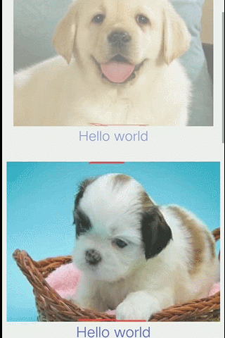
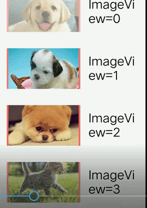

# SelfAdjointView
[中文参见这里](./readme_cn.md)

SelfAdjointView is an Android library that allows developers to easily let view change with the parent 
which can scroll. The animation contains one or more of parallax,alpha,scale.

## Apply to
- ScrollView/HorizontalScrollView
- ListView/GridView
- RecyclerView
- ViewPager
- sth else that can scroll

## EFFECT
---
 ............. 

---
.............. 

## Samples
[click me](./apk/sample-debug.apk)

## How do I use it?

### Setup
```
dependencies {
  // jCenter
  compile 
}
```

### Parallax
Now the effect can only use for image while the image can be places in any viewgroup provided it is AdjointImageView and it is wrapped by AdjointContainer. Note that in this condition, AdjointContainer should only have one child, and height/width of image should be larger than that of container(vertical move).


#### Step 1

Code in layout

```
...<sth like scrollview>...
<LinearLayout xmlns:android="http://schemas.android.com/apk/res/android"
              android:layout_width="match_parent"
              android:layout_height="match_parent"
              android:background="#66ffffff"
              android:orientation="horizontal"
              android:padding="10dp">
    <com.cysion.adjointlib.view.AdjointContainer
        android:id="@+id/container"
        android:layout_width="180dp"
        android:layout_height="100dp"
        android:layout_gravity="center_horizontal"
        android:layout_margin="10dp"
        >
        <com.cysion.adjointlib.view.AdjointImageView
            android:id="@+id/img_holder_img"
            android:layout_width="match_parent"
            android:layout_height="wrap_content"
            android:adjustViewBounds="true"
            android:background="#99ff0000"
            android:padding="3dp"
            />
    </com.cysion.adjointlib.view.AdjointContainer>
    ...other view...
</LinearLayout>
...</sth like scrollview>...
```

#### Step 2

Set scroll View's location in Rect and provide a locator for AdjointContainer.

```java
public class SecondActivity extends AppCompatActivity implements Locator...
mContainer1 = (AdjointContainer) findViewById(R.id.adcontainer1);
..	{
		mScrollView.post(new Runnable() {
            @Override
       		public void run() {
		 	mScrollView.getGlobalVisibleRect(mR);
 			mContainer1.setLocator(SecondActivity.this);
		}
});
..	}
	@Override
    public Rect getLocation() {
        return mR;
    }

```

#### Step 3

create an obj of AdjointStyle and add it to the container.

```java
 AdjointStyle style= new VerticalMoveStyle().minScale(0.9f);
 mContainer1.addStyle(style);
```
 and now when parent scrolls, the image scrolls too.


### Alpha/Scale

View(s) to show these effect should be wrapped in AdjointContainer.

#### Step 1

Code in layout

```
<ScrollView
    xmlns:android="http://schemas.android.com/apk/res/android"
    android:id="@+id/scroller"
    android:layout_width="match_parent"
    android:layout_height="match_parent"
    >

    <LinearLayout
        android:layout_width="match_parent"
        android:layout_height="match_parent"
        android:orientation="vertical">

        <com.cysion.adjointlib.view.AdjointContainer
            android:id="@+id/adcontainer1"
            android:layout_width="match_parent"
            android:layout_height="wrap_content"
            android:layout_marginBottom="10dp">

            <com.cysion.adjointlib.view.AdjointImageView
                android:id="@+id/img_ad1"
                android:layout_width="match_parent"
                android:layout_height="wrap_content"
                android:adjustViewBounds="true"
                android:src="@mipmap/p1c"/>

            <TextView
                android:layout_width="wrap_content"
                android:layout_height="40dp"
                android:layout_alignParentBottom="true"
                android:layout_below="@+id/img_ad1"
                android:layout_centerHorizontal="true"
                android:text="Hello world"
                android:textColor="@color/colorPrimary"
                android:textSize="24sp"/>
        </com.cysion.adjointlib.view.AdjointContainer>
		....../other view.....
		....../other view.....
		....../other view.....
		....../other view.....
    </LinearLayout>

</ScrollView>

```

#### Step 2
Just like step2 in Parallex-step2.


#### Step 3

create one or more obj of AdjointStyle and add it to the container.

```java
AdjointStyle style= new VerticalMoveStyle().minScale(0.9f);
AdjointStyle style2= new VerticalAlphaStyle();
..
 mContainer1.addStyle(style);
 mContainer1.addStyle(style2);
..
```
 and now when parent scrolls, the image will change its alpha or scale.

##### Refer to sample app for more detail. 

License
-------

    Copyright 2017 CysionLiu

    Licensed under the Apache License, Version 2.0 (the "License");
    you may not use this file except in compliance with the License.
    You may obtain a copy of the License at

       http://www.apache.org/licenses/LICENSE-2.0

    Unless required by applicable law or agreed to in writing, software
    distributed under the License is distributed on an "AS IS" BASIS,
    WITHOUT WARRANTIES OR CONDITIONS OF ANY KIND, either express or implied.
    See the License for the specific language governing permissions and
    limitations under the License.